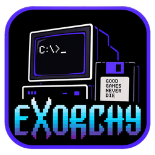
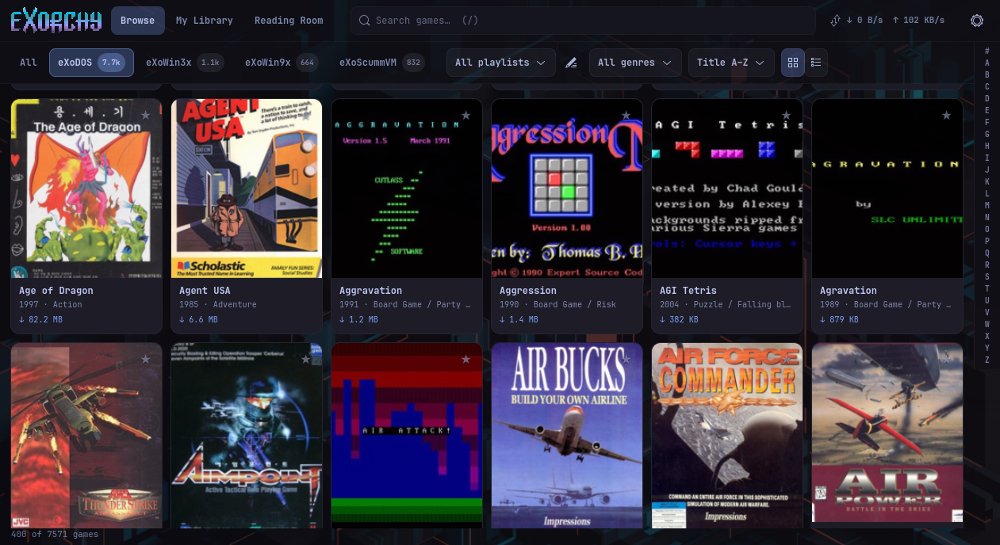
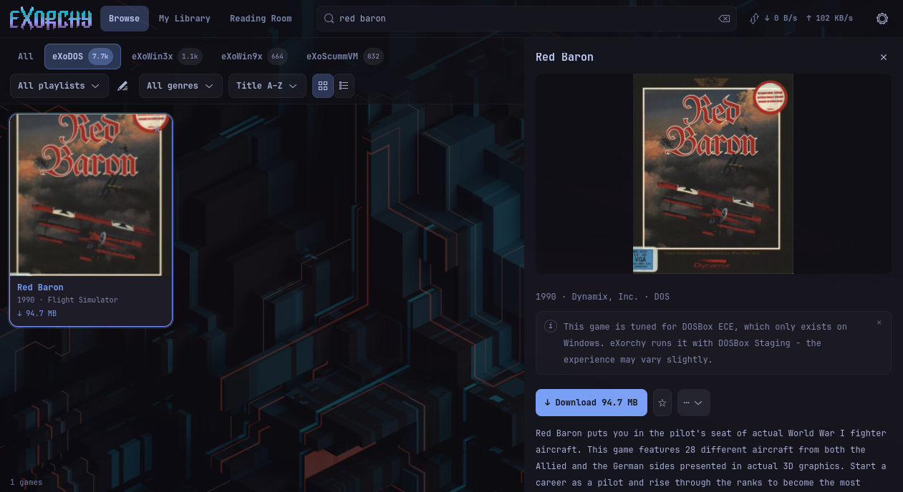
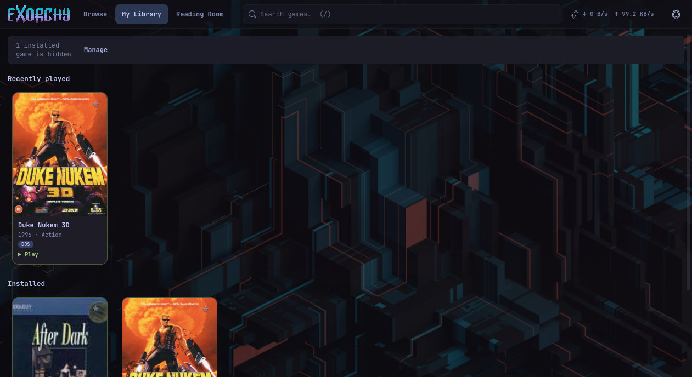

<p align="center">
  _ on screen, a floppy that says GOOD GAMES NEVER DIE, and the eXorchy wordmark" />
</p>

# eXorchy

An [Omarchy](https://omarchy.org)-native launcher for the
[eXoDOS](https://www.retro-exo.com/exodos.html) collections. Browse the
catalogue, download single games straight from the eXo torrents, and play
DOS, Windows 3.x, Windows 9x and ScummVM games on Arch + Hyprland. A native
GTK4 application written in Rust; the interface follows your Omarchy theme,
live.

<p align="center">
  _ on screen and a floppy that says GOOD GAMES NEVER DIE" />
</p>

---

## A tribute to eXoDOS

eXorchy would not exist without the extraordinary work of the
[eXoDOS project](https://www.retro-exo.com/exodos.html) and its creator,
**eXo**. Over many years, eXo and the eXoDOS community have collected,
configured, tested and preserved thousands of DOS games, and then did it again
for Windows 3.x, Windows 9x and ScummVM titles, each one pre-configured to run
out of the box, with manuals, box art, soundtracks, magazines and books
alongside. The result is an irreplaceable archive of gaming history, kept
alive by people who ask nothing in return.

eXorchy is only a frontend for that collection. It does not host or distribute
any game files; everything it shows and plays comes from the eXo torrents that
you download and seed yourself. If you find value in eXorchy, please support
the eXoDOS project directly at [retro-exo.com](https://www.retro-exo.com).

## Thank you, Thomas

eXorchy is derived from [Exodium](https://github.com/tvollstaedt/exodium) by
**Thomas Vollstädt**, released under the MIT License. Almost everything that
makes eXorchy work is his: the bundled catalogue instead of eXo's 5 GB metadata
archive, streaming one game at a time out of the torrents, translating eXo's
DOSBox-ECE configurations for DOSBox Staging, the language-pack overlays, the
save-preserving uninstall, the Windows 9x and ScummVM launchers, the preview
player and the reading room, and the hundreds of tests and written-down
decisions that explain why each of them works the way it does. eXorchy gives
that codebase an Omarchy home: Linux-only, themed by Omarchy, packaged for
Arch. Thank you, Thomas. If eXorchy is useful to you, consider supporting his
work on [GitHub Sponsors](https://github.com/sponsors/tvollstaedt) or
[Ko-fi](https://ko-fi.com/tvollstaedt). See `ACKNOWLEDGEMENTS.md` for the
full list of credits.

---

## What it does

- Every eXo collection: eXoDOS, eXoWin3x, eXoWin9x and eXoScummVM (on from
  the start), the German, Spanish and Polish language packs (switches in
  Settings → Collections), plus the Media Pack reading room.
- Streams single games on demand from the eXo torrents (no full download);
  downloads resume after a restart, seeding is opt-in.
- DOSBox Staging 0.83.0 downloaded automatically (29 MB) or your own
  `dosbox-staging`; DOSBox-X and 86Box fetched for Windows 9x; ScummVM builds
  pinned per game.
- eXo's DOSBox-ECE configs translated for Staging; MT-32 and General MIDI via
  the ROMs and soundfont fetched from the collection.
- Preview videos and theme music streamed straight out of the archives, a
  gallery of box scans and screenshots, manuals and the reading room's
  magazines rendered in-app (poppler).
- Per-game settings, favourites, playlists, My Library, save-preserving
  uninstall, storage overview.
- A Transfers page (click the connection badge): what is downloading, what
  waits, and every torrent with its own speed, peers and upload.
- Hide any title from the lists (an installed one stays searchable and
  playable); adult titles are hidden until you switch them on in
  Settings → Hidden titles.
- Your own background image behind the library, with an opacity slider, and
  an option to open straight into My Library.
- Tells you when a new release is out and updates itself: one click opens a
  terminal that installs it (pacman asks for your password) and eXorchy
  starts again.
- A native GTK4 / libadwaita window: no web view, no title bar (Hyprland
  draws the borders and tiles it), a virtualised grid that stays smooth on
  11,000 games, keyboard-first navigation.
- Omarchy theming: palette, light/dark mode, font and base size from the
  current theme, updated the moment you run `omarchy theme set`.

## Screenshots

<p align="center">
  
</p>
<p align="center"><em>Browse the whole catalogue, filtered by collection, genre or playlist.</em></p>

<p align="center">
  
</p>
<p align="center"><em>Search, then open a game: box art, details, notes and one-click download.</em></p>

<p align="center">
  
</p>
<p align="center"><em>My Library: recently played and installed games, ready to play.</em></p>

## Install

On Omarchy (or any up-to-date Arch, x86_64), one line installs the latest
release, and running it again updates:

```bash
curl -fsSL https://github.com/renanmt/exorchy/releases/latest/download/install.sh | bash
```

The script downloads the prebuilt pacman package from the
[latest release](https://github.com/renanmt/exorchy/releases/latest), checks
its SHA-256 and installs it with `pacman`, which pulls in GTK, libadwaita,
poppler and GStreamer from the Arch repositories. It asks for your password
and for pacman's confirmation; nothing is installed outside the package.

Prefer to do it by hand? Download `exorchy-x86_64.pkg.tar.zst` and its
`.sha256` from the release page, then:

```bash
sha256sum -c exorchy-x86_64.pkg.tar.zst.sha256
sudo pacman -U exorchy-x86_64.pkg.tar.zst
```

Then launch **eXorchy** from the Omarchy launcher (Super+Space) or run
`exorchy`. Preview videos and theme music need `gst-plugins-good` and
`gst-libav` (the players hide themselves when GStreamer cannot decode).
Optional: `omarchy pkg aur add dosbox-staging-bin` and enable "Prefer system
dosbox-staging" in Settings → Emulators.

From a checkout instead: `cd packaging && makepkg -si` (system-wide) or
`packaging/install-dev.sh` (under `~/.local`, needs rustup).

## Update

**From eXorchy 0.4.0 on, the app updates itself.** A few seconds after it
starts (and every few hours) it checks for a new release; when one is out, a
banner at the top of the library offers:

- **Update**: eXorchy closes, a terminal installs the new version (pacman asks
  for your password) and eXorchy starts again. If anything goes wrong, the
  version you had starts instead.
- **What's new**: the release notes on GitHub.
- **Skip this version**: no more reminders until the next release.

You can also check by hand in Settings → About → **Check now**, and turn the
automatic check off in Settings → General → **Check for updates**.

**By hand, or from eXorchy 0.3.0 and older** (which cannot update itself yet):
run the install line again. It installs the latest release over the one you
have and keeps your settings, library and games:

```bash
curl -fsSL https://github.com/renanmt/exorchy/releases/latest/download/install.sh | bash
```

To install a particular version instead:

```bash
curl -fsSL https://github.com/renanmt/exorchy/releases/latest/download/install.sh | bash -s -- --version v0.5.0
```

Everything that changed is in [CHANGELOG.md](CHANGELOG.md).

**Installed with `packaging/install-dev.sh`** (under `~/.local`): the banner
tells you about new releases but cannot update that copy. Pull and rebuild
with `git pull && packaging/install-dev.sh`. (A copy built with
`cd packaging && makepkg -si` is a normal pacman package: Update replaces it
with the release build.)

## Remove

```bash
sudo pacman -R exorchy
```

or `curl -fsSL https://github.com/renanmt/exorchy/releases/latest/download/install.sh | bash -s -- --uninstall`. Your settings, library
and downloaded games stay (in `~/.local/share/exorchy`,
`~/.local/state/exorchy` and your game folder).

## Keyboard

| Key | Action |
|---|---|
| `/` | focus the search field |
| arrows, Page Up/Down, Home/End | move through the grid or list |
| Enter (or double-click) | open the selected game in the detail panel |
| Esc | close the detail panel; leave Settings or Transfers |
| Ctrl+, | open Settings |

## Build from source

```bash
export PATH="$HOME/.cargo/bin:$PATH"
cargo build --release -p exorchy          # target/release/exorchy
cargo run -p exorchy                      # run from the checkout (resources resolve to it)
cargo test -p exorchy-core                # backend tests
cargo test -p exorchy                     # UI unit tests
cargo clippy --workspace --all-targets -- -D warnings
```

`RUST_LOG=exorchy_core=debug,librqbit=info` makes the log verbose;
`EXORCHY_SNAPSHOT=/tmp/shot.png:4000` renders the window to a PNG and quits
(a developer aid for checking layouts without a compositor screenshot).

Documentation for contributors and future agents lives in `docs/`:
`HANDOVER.md`, `ARCHITECTURE.md`, `DECISIONS.md`, `COLLECTIONS.md`,
`PORTING.md`.

## Credits

Besides eXoDOS and Exodium (above): the Omarchy integration took inspiration
from [omakade](https://github.com/btsouth/omakade), a native Omarchy front
end for emulators. omakade is GPL-licensed and eXorchy shares no code with
it; what carried over is the idea that an Omarchy app should be a native
window that reads the theme directory directly.

## License

MIT. Copyright (c) 2026 Renan Tonheiro; portions copyright (c) 2026 Thomas
Vollstädt (Exodium). DOSBox Staging is GPL-2.0 and downloaded separately from
its own releases.
