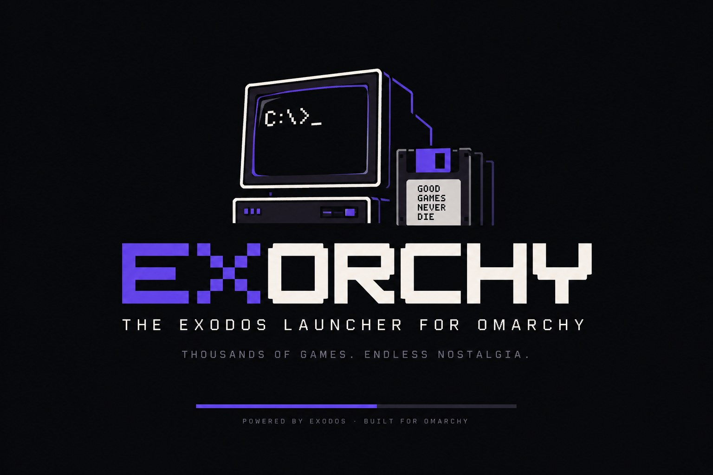

# Exorchy

An [Omarchy](https://omarchy.org)-native launcher for the
[eXoDOS](https://www.retro-exo.com/exodos.html) collections. Browse the
catalogue, download single games straight from the eXo torrents, and play
DOS, Windows 3.x, Windows 9x and ScummVM games on Arch + Hyprland. The
interface follows your Omarchy theme, live.

<p align="center">
  _ on screen and a floppy that says GOOD GAMES NEVER DIE" />
</p>

---

## A tribute to eXoDOS

Exorchy would not exist without the extraordinary work of the
[eXoDOS project](https://www.retro-exo.com/exodos.html) and its creator,
**eXo**. Over many years, eXo and the eXoDOS community have collected,
configured, tested and preserved thousands of DOS games, and then did it again
for Windows 3.x, Windows 9x and ScummVM titles, each one pre-configured to run
out of the box, with manuals, box art, soundtracks, magazines and books
alongside. The result is an irreplaceable archive of gaming history, kept
alive by people who ask nothing in return.

Exorchy is only a frontend for that collection. It does not host or distribute
any game files; everything it shows and plays comes from the eXo torrents that
you download and seed yourself. If you find value in Exorchy, please support
the eXoDOS project directly at [retro-exo.com](https://www.retro-exo.com).

## Thank you, Thomas

Exorchy is derived from [Exodium](https://github.com/tvollstaedt/exodium) by
**Thomas Vollstädt**, released under the MIT License. Almost everything that
makes Exorchy work is his: the bundled catalogue instead of eXo's 5 GB metadata
archive, streaming one game at a time out of the torrents, translating eXo's
DOSBox-ECE configurations for DOSBox Staging, the language-pack overlays, the
save-preserving uninstall, the Windows 9x and ScummVM launchers, the preview
player and the reading room, and the hundreds of tests and written-down
decisions that explain why each of them works the way it does. Exorchy gives
that codebase an Omarchy home: Linux-only, themed by Omarchy, packaged for
Arch. Thank you, Thomas. If Exorchy is useful to you, consider supporting his
work on [GitHub Sponsors](https://github.com/sponsors/tvollstaedt) or
[Ko-fi](https://ko-fi.com/tvollstaedt). See `ACKNOWLEDGEMENTS.md` for the
full list of credits.

---

## What it does

- Every eXo collection: eXoDOS, the German, Spanish and Polish language packs,
  eXoWin3x, eXoWin9x, eXoScummVM, plus the Media Pack reading room. Only
  eXoDOS is on at first; the others are switches in Settings → Collections
  and stay invisible until enabled.
- Stream single games on demand from the eXo torrents (no full download)
- DOSBox Staging 0.83.0 downloaded automatically (29 MB) or your own
  `dosbox-staging`; DOSBox-X and 86Box fetched for Windows 9x; ScummVM builds
  pinned per game
- eXo's DOSBox-ECE configs translated for Staging; MT-32 and General MIDI via
  the ROMs and soundfont fetched from the collection
- Preview videos and theme music streamed straight out of the archives, a
  gallery of box scans and screenshots, manuals in-app
- Per-game settings, favorites, playlists, My Library, save-preserving
  uninstall, storage overview
- Omarchy theming: palette, light/dark mode, font and base size from the
  current theme, updated the moment you run `omarchy theme set`

## Install

Requirements: Omarchy (or any Arch with `webkit2gtk-4.1`, `gtk3`, `libsoup3`).

```bash
# user-level, from a checkout (needs rustup + pnpm)
packaging/install-dev.sh
# or system-wide
cd packaging && makepkg -si
```

Then launch **Exorchy** from the Omarchy launcher (Super+Space) or run `exorchy`.
Optional: `omarchy pkg aur add dosbox-staging-bin` and enable "Prefer system
dosbox-staging" in Settings → Emulators.

## Develop

```bash
export PATH="$HOME/.cargo/bin:$PATH"
pnpm install
pnpm tauri dev
pnpm typecheck && pnpm test                       # frontend
cargo test --manifest-path src-tauri/Cargo.toml   # backend
node scripts/ui-smoke.mjs                         # headless UI screenshots (dev server running)
```

Documentation for contributors and future agents lives in `docs/`:
`HANDOVER.md`, `ARCHITECTURE.md`, `DECISIONS.md`, `COLLECTIONS.md`.

## License

MIT. Copyright (c) 2026 Renan Tonheiro; portions copyright (c) 2026 Thomas
Vollstädt (Exodium). DOSBox Staging is GPL-2.0 and downloaded separately from
its own releases.
